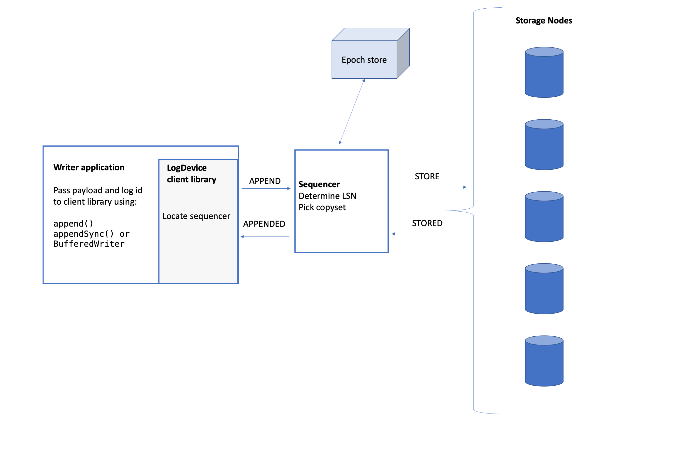
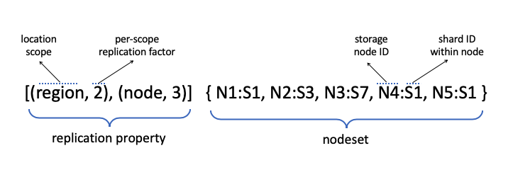
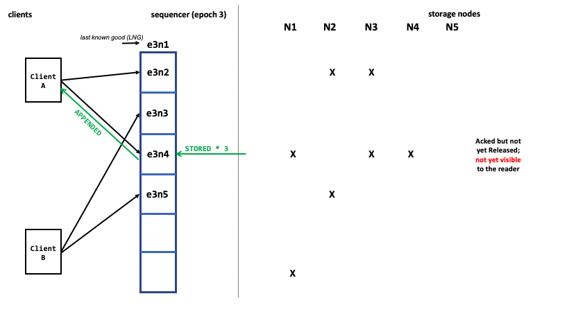

To add records to a log, an application calls the client library to initiate the appends. The client library interacts with a sequencer node which in turn interacts with storage nodes.  A record is acknowledged as appended to the client writer only after it has been stored by the nodes according to the replication policy.

LogDevice servers (nodes running the `logdeviced` process) have either a storage or a sequencer role, or both. Nodes acting as sequencers are in charge of assigning a monotonically increasing sequence number to each record in a log, and sending the record to a set of storage nodes. Nodes with the storage role are responsible for storing log records, and, at read time, delivering log records to readers.

## Client Writer

Let's look at how an append request proceeds through the system from the client's perspective.

**LogDevice write path**

1. The application passes the client library a payload and a log-id through the append API.
2. The client uses a gossip-based failure detector and consistent hashing-based routing mechanism to determine the sequencer node for the log. It sends an APPEND request that includes the payload to the sequencer.
3. The sequencer assigns a log sequence number (LSN) to the record and sends it to storage nodes.
4. After successfully replicating the record, the sequencer returns APPENDED with the LSN of the stored record.

Within each application thread, the client sends each record for the same log to the sequencer in the order in which it was received.

## Sequencer

The sequencer assigns sequence numbers to records and supervises record replication.

There is usually one active sequencer object per log, so if a cluster has 1 million logs, there are 1 million sequencer objects. As you would expect, one LogDevice server can run multiple sequencer objects.

### Activation

If a node gets an APPEND and it determines that it should have the sequencer role for the log, then it creates a sequencer object. The sequencer gets the epoch number and the replication configuration from the epoch store. It uses the epoch number and its own internal offset to issue an LSN to a record.

The epoch configuration includes the replication property and the nodeset for the log. The nodeset is only allowed to change when the epoch does; any modifications to nodeset selection forces a sequencer re-activation.

If the log is not provisioned yet, the sequencer starts auto log provisioning to create both the initial metadata and the metadata log for the log. There is one metadata log for each data log stored on the cluster.

See [Log replication configuration](Replication.md) for more about epoch configuration and metadata logs.

### Replication property

The replication property for a log includes the location scope, the region replication factor, and some constraints on the location. It's set on a per-log basis (see `replication_property` in [LDQuery](ldquery.md#log-\_groups).

**A simplified view of the replication configuration**

### Appending Data Records

 The sequencer creates and manages appender objects for replicating data records onto storage nodes. Let's look at an append from the perspective of the sequencer.

1. For each APPEND that the sequencer receives, it creates an appender state machine that is responsible for replicating that record. The sequencer passes the appender instance a record and the LSN for the record.
2. The appender picks a copyset, which is the set of nodes that it will ask to store copies of the record, from the nodeset according to the replication properties.
3. The appender sends a STORE message to each node in the copyset. This attempt to replicate copies of the record on all storage nodes in the copyset is called a "wave". If all goes well, there should be one wave per append. The appender waits for the STORED reply from these storage nodes.
4. If all nodes could not successfully store within a timeout:
    1. The appender graylists the node(s) that did not reply.
    2. It blacklists any node that replies STORED but with a failure.
    3. The appender starts a new wave by picking a new copyset (ignoring the gray- and blacklisted nodes).
5. When all nodes in the copyset successfully reply with STORED, the appender returns APPENDED to the client and tells the sequencer that the append is complete. The sequencer acknowledges the write to the client.

### Pipelining appends

Appends are run in parallel with multiple records in-flight at the same time. Within the sequencer, there is a sliding window of appender objects, one for each record. When the oldest append is complete, the window moves along one position.

The “left” end of the sliding window is the last acknowledged and completed append of the epoch. Its LSN is the last known good (LNG) sequence number for the epoch.

LogDevice supports out-of-order ACKs: a record is acked as soon as its appender finishes replication. But the sequencer won't slide the window until the  record with the smallest LSN in the sliding window has been replicated and acked. If the oldest active appender cannot store its record and the window fills up, the sequencer returns a `SEQNOBUF` error to the clients to indicate that it cannot accept new APPENDs.

**Out-of-order acknowledgements**

### Releasing records to readers

The storage nodes only make records that have been released visible to the readers. Acked records may not be immediately visible to the readers &mdash; they must be released first.

The sequencer releases records when both of these conditions are met:

* All previous records have been fully replicated and acked.
* Any recovery of previous epochs has completed (see [Recovery after the failure of a sequencer](Recovery.md)).

The sequencer broadcasts two pointers: the “last known good” of the epoch, and the release pointer of the log.

* The “last known good” indicates the last acknowledged and completed append of an epoch. The storage nodes use it as a checkpoint.
* The release pointer is the LSN of the last completed append of the log. All records up to and including that LSN, including all previous epochs, have been stored consistently. The storage nodes deliver records to readers up to the release pointer.

You can see appends in action by watching this video:
<video controls="controls" width="800" height="600"
       name="Appends" src="assets/writepath/write_path.mov"></video>

### Sticky copysets

Sticky copysets is a technique that efficiently groups records on storage nodes in large variable size blocks. If enabled,
the appender uses one copyset for a large number of consecutive records in the same log, for as long as the writes to each node in the copyset successfully complete.

This feature can be controlled using the `enable-sticky-copysets` setting and via the `sticky-copysets `attribute that is set in the log config file. See [settings.md#write-path] and [log_configuration.md#sticky-copysets].

### Storage node errors (Blacklisting and Graylisting)

Sequencers blacklist storage nodes that report that they are not able to accept records. They graylist nodes, meaning that they don't try to send them records for a while, if the nodes don't respond within a timeout.

### Epoch number

The epoch store is a metadata component, stored in Zookeeper, that contains durable counters for each log. The epoch number is the upper 32 bits of the log sequence number (LSN) that the sequencer assigns to each record. Epoch numbers never regress.

The epoch number is incremented, or bumped, when a new sequencer is activated or reactivated. This occurs in the following situations:

* When a new log is started.
* When a sequencer node crashes or otherwise becomes unavailable.
* If the nodeset for a log changes, such as when the cluster shrinks or expands.
* If the replication property for a log changes (i.e., logs configuration update).

### Multiple writers per log

Many clients can write to the same log. Records are written in sequence number order, i.e. the order they are received by the sequencer. If that is not sufficient ordering for the applications, then they can implement some out-of-band communication to add an ordering key to each record.

### Load balancing

If you have a heterogeneous set of hardware, you can configure weights for storage and sequencer nodes in the node configuration. The weight values are used to balance APPENDs across sequencer nodes and STOREs across storage nodes.

* `storage_weight` defines the amount of data to be stored compared to other machines. You should assign weights to systems according to their relative disk size.
* `sequencer_weight` is used when determining number of sequencers to be placed on a node. Assign a larger weight to the nodes with the fastest hardware / most memory.

[See how to configure `sequencer_weight` and `storage_weight`.](configuration.md#roles-and-state-roles-sequencer-sequencer_weight-storage-and-storage_weight)

### Load balancing across logs

Logs are assumed to have similar throughput, so a log with extremely high throughput can cause a bottleneck. To avoid issues, the writing application can balance the load by sharding its data, with each shard corresponding to a log. If sharding is already employed, the application should split the hot shard.

## Batching and compression

In the simplest case, each payload that the clients sends to the sequencer corresponds to one record. As an optimization, the application can use BufferedWriter to batch up writes. This is usually the preferred option.

BufferedWriter collects appends into a buffer until either a time or size threshold is reached. When a threshold is triggered, BufferedWriter sends the batch of records in a single APPEND message to the sequencer.

The sequencer includes a very similar feature called SequencerBatching. SequencerBatching is beneficial if there are a large number of writers for a log (large write fan-in). When configured, multiple records from different clients that are all writing to the same log are batched and appended with one LSN. It may even batch records that have already been batched by BufferedWriter.

Batching is transparent to the reader with the only caveat that records within the same batch appear to have the same LSN. For those records, you can use the (LSN, batch_offset) combination to distinguish between them, and they are delivered to the reader in the same (LSN, batch_offset) order.  

Both BufferedWriter and SequencerBatching compress data according to the [batching and compression settings](settings.md#batching-and-compression).

For more about the BufferedWriter API, go to [Client library API](API_Introduction.md).
