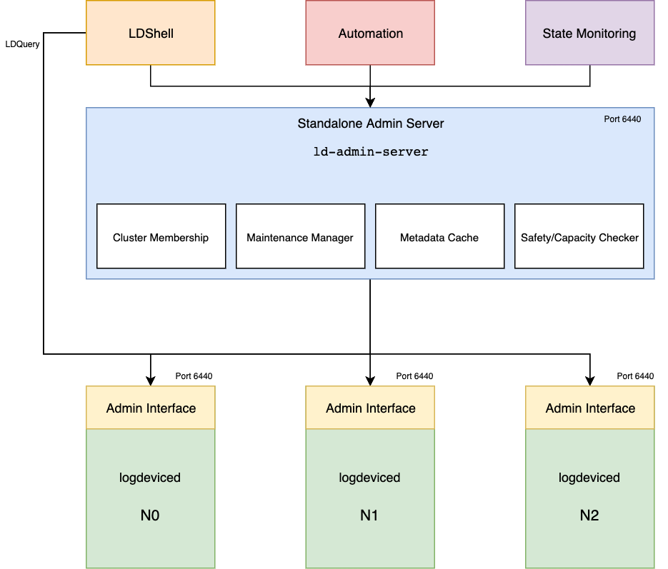
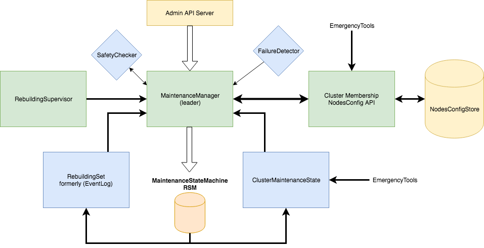

The standalone Admin Server (`bin/ld-admin-server`) is a side-car service that runs next to any LogDevice cluster. It extracts the necessary components that are needed to serve the [Admin API](https://github.com/facebookincubator/LogDevice/blob/master/logdevice/admin/if/admin.thrift) requests into its own daemon that can be deployed with its own release cadence.

The admin server also runs embedded in every `logdeviced` instance but with a
lot of the features disabled. This gives the flexibility of running a separate
administrative service that runs on its own host (for reliability and separation
 of concerns purposes) or you can pick one of the nodes of the cluster and
enable the necessary features on the admin server component of this `logdeviced` instance. (e.g, by passing to enable maintenance manager `--enable-maintenance-manager`).

Note that the temporary unavailability of the standalone admin server will not
affect the critical path of the service. LogDevice storage nodes and sequencers
will continue to be operational but you will lose the ability to introspect some
of the state and all [maintenance operations](administration/maintenances.md) will wait until
the standalone admin server is started again.

> Recommendation: We prefer running a separate admin server (standalone service)
> per cluster which can be updated and pushed with a different release train 
> than the storage daemons.

## What is the Admin API?
The Admin API is a thrift RPC service that offers a gateway for tooling and
automation to perform introspection queries or maintenance operations on a given
cluster. The [thrift IDL file](https://github.com/facebookincubator/LogDevice/blob/master/logdevice/admin/if/admin.thrift) is well documented.

Most of the command that you see in [LDShell](administration/ldshell.md) use the Admin API
behind the scenes to offer the functionality but you can write your own client
in your favorite language if you need to build automation on top of it.

## Why do we need Admin Server?
The admin server hosts a critical event-driven orchestration component called
the [Maintenance Manager](#the-maintenance-manager). It's the component that powers the automatic
execution and tracking of [maintenance operations](administration/maintenances.md) in a safe
and convergent fashion. Later in this document we will explain all of that in
details.

The admin server is also a great non-intrusive way to simulate outages via the
internal [Safety Checker](safety_checker.md) that will give you confidence in
whether an operation can be done safely or not.

> Note that **Maintenance Manager** will make sure that any maintenance request
> is safe before performing any action on the cluster, so in most cases if you
> don't need to run the safety checker simulations manually. But it can be
> useful if you just want to test a scenario without applying it.

## The Maintenance Manager

The maintenane manager is a central event-driven orchestration system for
LogDevice clusters. It is responsible for guaranteeing safety of maintenance
operations and automatic sequencing and resolution of maintenance requests
coming from different actors or users.

### Key Features
1. **Cluster membership management**: In conjunction with the
   `node-self-registration` feature in logdeviced and the zookeeper-backed nodes
   configuration store. Maintenance manager orchestrates cluster toplogy changes
   by driving the maintenance transitions necessary to get the new nodes ready
   to serve production traffic or drain them cleanly to ensure safety of node
   removal if a cluster shrink operation is needed.
2. **Data durability management**: Upon requesting maintenance operations that
   will result in long-term unavailability of a storage node or in cases where
   data can be under-replicated for periods that go beyond the
   `self-initiated-rebuilding-grace-period`, Maintenance manager will trigger
   data re-replication/rebuilding to restore the durability requirements and
   apply internal maintenance automatically.
3. **Maintenance operations management**: It's responsible for storing
   maintenance requests along with metadata information in a couple of internal
   logdevice logs. The maintenance requests represent maintenance *targets* that
   will be stored and asynchronously evaluated. The maintenance manager will
   only attempt to change the current status to the target it it's safe to do so
   via the [Safety Checker](safety_checker.md). If an operation is unsafe, it
   will block the maintenance until it's safe. It will continuously evaluate all
   blocked maintenances and allow some of them to proceed if it became safe.
   There is no need to manually retry maintenances externally since this is an
   automatic convergent system.
4. **Metadata logs nodeset management**: As the user drains more nodes, the
   maintenance manager will attempt to extend the internal nodeset for metadata
   logs with nodes that are `ENABLED`. This increases the chances of future
   maintenances succeeding by reducing internal dependency on nodes that are
   already drained.
5. **Operational observability**: The maintenance manager offers great
   introspection abilities into the internals (available via ldshell's
   `maintenance` set of commands). It helps users understand why maintenances
   are blocked and what is the current state of the system.

### Per-shard maintenances
Maintenance manager supports performing maintenance on the granularity of a single
shard/disk attached to a single `logdeviced` storage node. You can apply the
maintenance on all shards for a given node as well or multiple nodes in a
single maintenance. The API and ldshell commands give you the control to perform
any type of maintenance that you require.

A maintenance for a given shard means that you want to change it's
`ShardOperationalState` from `ENABLED` to one of the following possible targets:
- `MAY_DISAPPEAR`: A shard/node in this state means that it's safe to unplug the
disk or if all shards on a given logdeviced have reached that state it means
that it's safe to stop the `logdeviced` hosting these shards. `MAY_DISAPPEAR`
means that it's *safe to take this shard/node down* but it also means that we
don't expect this shard/node to be taken down for too long. This is due to the
fact that in this state we accept a temporary under-replication of data as long
as we have enough copies left to maintain read/write/rebuilding availability
(see [Safety Checker](safety_checker.md) for details). The shard/node in this
state will internally switch itself to `READ_ONLY` storage state, so as long as
the daemon is `ALIVE` we will be serving read traffic. If the node/shard is
stopped (became unavailable by any means) a timer will kick in against the
configured `self-initiated-rebuilding-grace-period` setting. If the node didn't
come back `ALIVE` within this grace period, the system will apply an internal
maintenance with a target `DRAINED` on this shard/node to restore the
replication factor automatically. See [Stacking
Maintenances](#stacking-maintenances) on how this works.
- `DRAINED`: a shard/node in this state means that we don't need the data on
this node anymore. Taking this node down, wiping it, or even removing it
completely from the cluster won't affect availability nor replication factor
(data durability). It also implies that a `DRAINED` node also matches the
`MAY_DISAPPEAR` state. So, any node/shard that is in `DRAINED` is considered
safe to disappear at any time. Internally, we will stop serving reads or writes
from this node.

Note that in maintenances you have to choose between `MAY_DISAPPEAR` and
`DRAINED` only. The list of other possible values for `ShardOperationalState`
are not valid targets but they can represent transitional states that the
system uses to describe the internal transitions.

Checkout the documentation in the [thrift IDL file](https://github.com/facebookincubator/LogDevice/blob/master/logdevice/admin/if/nodes.thrift) with
a description on each possible value for `ShardOperationalState`.

### Sequencer maintenances
Maintenance manager also supports applying maintenance on the sequencers running
on nodes. Sequencers are much simpler in the sense that you can only **disable**
sequencers on a given node. Assuming that safety checker allows this transition,
the node will stop being a target for running sequencers and the active
sequencers running on that node will move away to another node.

### Stacking Maintenances
Maintenance manager supports the notion of maintenance stacking. For any given
storage node or sequencer node, multiple maintenances with different targets can
be applied at the same time. There are a few rules around this design, if the
maintenances being created didn't match the rules, you will receive a
`MaintenanceClash` exception.

The set of rules are:
- You cannot apply multiple maintenances by the same `user` (as defined in
  `MaintenanceDefinition`) on nodes/shards that overlap with existing
maintenances unless the new maintenance and the existing maintenance are
**identical**. In this case, the system will return the existing maintenance
progress instead of creating a new one. So, applying the exact maintenance
multiple times is a no-op and will return the progress for the existing
maintenance instead of creating a new one. However, if the `user` is different,
a new maintenance is created.
- A shard/node/sequencer that has reached the maintenance target (`DRAINED` or
  `DISABLED` for sequencers) **will remain** in that state as long as the
maintenance is **not** removed. This is the system guarantee that allows users
to take actions on a shard/node **after** the _current_ state reaches the
_target_. You can think of it as a lease acquisition on the resource. However,
  applying the maintenance on its own without waiting for the maintenance to be
  applied (current < target) is not a guarantee by any means.
- The shard/node will not switch themselves into `ENABLED` unless **all**
maintenances have been removed from a shard/node. However, a shard/node may go
from `DRAINED` to `MAY_DISAPPEAR` if all maintenances that need this shard/node
to in `DRAINED` state are removed, given that we still have maintenances that
require the shard/node to be in `MAY_DISAPPEAR`. This works since `DRAINED` >
`MAY_DISAPPEAR`.

As a general rule, users of the maintenance manager will need to do the
following to guarantee safety of external operations:
1. Apply a maintenance with the appropriate `user` on the given set of
   shards/nodes/sequencers. This is **always** required even if we know that the
   _current_ operational state matches what we need. It's needed because we
   don't have any guarantees that the existing maintenances will not be removed
   while we are performing our own operations, so we need to apply our own
   maintenances to acquire a lease that protect safety.
2. Monitor the current operational state of the nodes/shards until all of them
   reach __at least__ the target that we are waiting. For
   `ShardOperationalState` it means that `DRAINED` is the strongest guarantee
   and `DRAINED` > `MIGRATING_DATA` > `MAY_DISAPPEAR`. So, if the shard is in
   `MIGRATING_DATA` then it **must** be safe to take it down. In order to
   reduce th complexity behind this reasoning, the `MaintenanceDefinition` (and
   also in ldshell output for maintenance commands) includes
   `MaintenanceProgress` that sums all of that up. If `MaintenanceProgress` for
   your maintenance is `COMPLETED` then this is all what you need to know to go
   ahead and apply your operations.
3. After you finish your operations (restarts, wiping, etc.). You **must**
   remove the maintenance that you applied. You shouldn't remove other
   maintenances applied on the shard/node unless this is _really_ what you want.

> Note that if all nodes/shards in a given maintenance have been removed from
> the cluster, the maintenance will be automatically purged asynchronously.

## Maintenance TTL
Maintenance manager supports applying a `time-to-live` value in seconds after
which the maintenance will automatically be removed regardless of its progress
or status. This is set to `0` by default (never expire). It's generally used to
set an upper bound on maintenance durations to avoid dangling maintenances that
are left over by automation or tooling.

## Grouped Maintenances
When applying a new `MaintenanceDefinition` to the maintenance manager, the
scheduling, order of execution, and the safety evalution are dependent on
whether the user accepts whether it's okay to have partial progress on
maintenances or not.

In order to explain this, let's run through a set of example scenarios:
### All-or-nothing Maintenances
A user `Foo` applies a `MAY_DISAPPEAR` maintenance on **all** nodes of the
cluster. By default we have `group = true` set on the `MaintenanceDefinition`.
This is also true in `ldshell` maintenance commands.

In this scenario, since `group` is set to `true`. Maintenance manager assumes
that the user cannot accept partial results, so it passes the entire set of
nodes of the cluster to [Safety Checker](safety_checker.md) which will
definitely **reject** this maintenance request since we will lose availability,
capacity, and data. So, **none** of the nodes will proceed into `MAY_DISAPPEAR`
and this maintenance will appear as `BLOCKED_UNTIL_SAFE`. The entire maintenance
is considered as a transactional unit. It's all or nothing.

### Exploded Maintenances
For the previous scenario, if the user supplies `group=false`. The maintenance
manager will explode the maintenance request into `N` requests where `N` equals
the total number of nodes that this maintenance references. It will group
sequencer and shard maintenances for every node into its own maintenance, so you
get exploded `N` maintenancees that can do progress on their own without waiting
on the rest of the exploded maintenances.

What this means for the scenario above is that we will allow the _maximum_
number of nodes to go into `MAY_DISAPPEAR` safely before rejecting the rest of
the created maintenances with `BLOCKED_UNTIL_SAFE`. In this case, the result of
the operation is a _set_ of maintenances, some will be allowed to be `COMPLETED`
while others will be `BLOCKED_UNTIL_SAFE`. The user can decide to finish
operations on the nodes that are good to go.

After finishing the operation, the user is allowed to _remove the individual_
maintenances for these nodes. Since this is a convergent system, the next batch
of maintenances will be allowed to unblock and again we will see a new set of
maintenances going into `COMPLETED`.

This can be used to perform something like a _rolling operation_ on the cluster
(maybe a rolling restart). Since you are not sure what is the maximum number of
nodes that we can restart at the same time safely, you will need to apply a
`group=false` maintenancen to `MAY_DISAPPEAR` the entire cluster. Then start
polling for maintenances that get `COMPLETED`, restart these nodes and remove
the maintenances for these nodes. Then keep doing this until all maintenances
that you created are removed.
