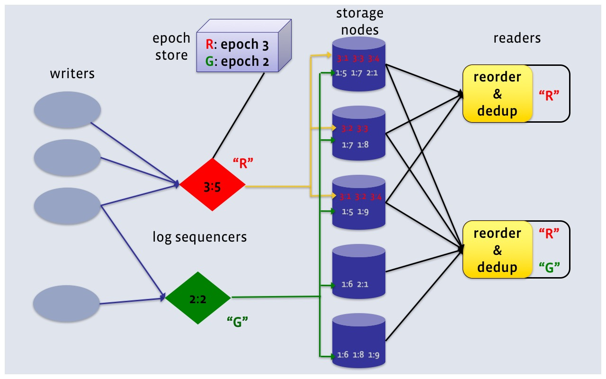

***

## Introduction

LogDevice is a distributed service that provides persistent storage
and delivery of records organized in sequences called **logs**. For
durability, copies of each record are stored across multiple servers
and failure domains. LogDevice uses a novel technique called
*non-deterministic decentralized record placement* in order to offer
high write availability and consistently low write latencies even as
some nodes in the cluster (or even entire failure domains, such as
racks or data centers), suffer a total failure, or a severe drop in
capacity or connectivity.

Log records are stored on **storage nodes** equipped with direct
attached storage. The local storage layer of LogDevice is designed to
deliver good performance on both SSDs and HDDs even if the number of
logs hosted by the cluster is in the hundreds of thousands. The one
read pattern that LogDevice is not optimized for and does not handle
well is random reads of individual log records.

## Consistency guarantees

The consistency guarantees provided by a LogDevice log are what one
would expect from a file, albeit a record-oriented one. Multiple
writers can append records to the same log concurrently. All those
records will be delivered to all readers of the log in the same order,
namely the order of their LSNs. If a record was delivered to one
reader, it will also be delivered to all readers encountering that
LSN, barring unlikely catastrophic failures that result in the loss of
all copies of the record.

LogDevice provides built-in data loss detection and reporting. Should
data loss occur, the LSNs of all records that were lost will be
reported to every reader that attempts to read the affected log and
range of LSNs.

The LSNs of records synchronously appended to the same log by the same
`logdevice::Client` object are guaranteed to be monotonically
increasing. The order of LSNs assigned to records appended to the same
log by different writer processes, or by the same process through
different `logdevice::Client` objects usually follows the rules of
causal consistency. However the causal consistency of writes may be
violated if network partitioning or node failure in the LogDevice
cluster forces the cluster to make the choice between write
availability (completing an append and assigning an LSN to it) and
causal consistency. In those rare cases we decided to have LogDevice
choose availability over consistency, as this is almost always the
preferred choice for Facebook workloads. Support for making individual
logs sequentially consistent (which implies causal) by giving up a
degree of write availability is currently in the works.

No ordering guarantees are provided across logs. The LSNs of records
from different logs are not comparable.

## Non-deterministic record placement

It's good to have options. Having a large number of placement options
for record copies improves write availability in a distributed storage
cluster. Similar to many other distributed storage systems, LogDevice
achieves durability by storing several identical copies of each record
(typically two or three) on different machines. With many placement
options for those copies you can complete writes even if a lot of
storage nodes in your cluster are down, slow, or out of disk space, as
long as the part of the cluster that is up can still handle the
load. You can also accommodate spikes in the write rate on a single
log by spreading the writes over all the nodes available. Conversely,
if a particular log or record is restricted to just a few specific
nodes, the maximum throughput of a single log will be limited by the
capacity of those nodes, and the failure of just a few nodes may cause
all writes on some logs to fail.

The principle of maximizing placement options for incoming data is
employed by many successful distributed file systems. In [Apache
HDFS](https://hadoop.apache.org/docs/r1.2.1/hdfs_design.html) for
instance a data block can be placed on any storage node in the
cluster, subject to the cross-rack and space constraints enforced by
the centralized metadata repository called the name node. In [Red Hat
Ceph](http://ceph.com/) data placement is controlled by a multi-valued
hash function. The values produced by the hash function provide
multiple placement options for an incoming data item. This eliminates
the need for a name node but cannot quite reach the same level of
placement flexibility.

LogDevice, with its focus on log storage, takes a different approach
to record placement. It provides a level of placement flexibility
equivalent to that offered by a name node without actually requiring a
name node. Here is how this is accomplished. First, we decouple the
ordering of records in a log from the actual storage of record
copies. For each log in a LogDevice cluster LogDevice runs a **sequencer**
object whose sole job is to issue monotonically increasing sequence
numbers as records are appended to that log. The sequencer may run
wherever it is convenient: on a storage node, or on a node reserved
for sequencing and append execution that does no storage.

**Figure 1. The separation of sequencing and storage in
LogDevice.**

Once a record is stamped with a sequence number, the copies of that
record may potentially be stored on any storage node in the
cluster. Their placement will not affect the order of records in which
all readers see the records of that log. We just need to make sure
that readers can efficiently find and obtain the copies. We use the
term **copyset** for the set of storage nodes on which the copies of a
particular record are stored. The copyset is selected at random, using
a weighted uniform distribution, and a replication policy.

The
replication policy for a log includes at least the replication factor
R, typically 2 or 3. A fault tolerant replication policy may mandate
the placement of copies in at least two hierarchical failure domains,
such as racks, data centers, or regions. In order to improve batching
the sequencer may continue to use the same copyset for a large number
of consecutive records in the log, as long as the writes on the copyset
successfully complete.  This technique is called sticky copysets.
It effectively groups records on storage nodes in large variable size
blocks.

A client that wishes to read a particular log contacts all storage
nodes that are permitted to store records of that log. That set,
called the **nodeset** of the log, is usually kept smaller than the
total number of storage nodes in the cluster. The nodeset is a part
of the log’s replication policy. It can be changed at any time, with
an appropriate note in the log’s metadata history. The readers consult
that history in order to determine the storage nodes to connect to.
LogDevice stores the history of changes to the nodeset of a log in a
special internal log called the **metadata log**. There is one metadata
log for each data log provisioned on the cluster.

Nodesets allow LogDevice clusters to stay efficient as the cluster
grows by limiting the number of nodes with which the readers of a
particular log must communicated. Nodes contacted by a reader client
deliver record copies to it by pushing them into TCP connections as
fast as they can. Naturally, the header of each record includes the
record's sequence number. The LogDevice client library performs the
reordering and occasional de-duplication of records in order to ensure
that records are delivered to the reader application in the order of
their LSNs.

While this placement and delivery scheme is great for write
availability and handling spiky write workloads, it would not be very
efficient for file workloads that often include many point reads. For
log reading workloads, which are largely sequential, it is quite
efficient. All storage nodes contacted by a reader will likely have
some records to deliver. No IO and network resources are
wasted. LogDevice ensures that only one copy of every record is read
from disk and delivered over the network by including the copyset in
the header of every record copy.

A simple server-side filtering scheme called **single-copy delivery**
(SCD) guarantees that in steady state only one node in the copyset
would read and deliver a copy of each record to a particular reader.
SCD is based on copysets and a dense **copyset index** maintained
by the local log store of each storage node.

## Sequence numbers

As shown in Figure 1, the sequence numbers of records in LogDevice are
not integers, but pairs of integers. The first component of the pair
is called the **epoch number**, the second one is offset within
epoch. The usual tuple comparison rules apply.

In code, the LSN is
defined as an 8 byte integer. The high 4 bytes contain the
epoch and the low 4 bytes are the offset.

The use of epochs in LSNs is
another write availability optimization. When a sequencer node crashes
or otherwise becomes unavailable, LogDevice must bring up replacement
sequencers for all of the affected logs. The LSNs that each new
sequencer starts to issue must be strictly greater than the LSNs of
all records already written for that log. Epochs allow LogDevice to
guarantee this without actually looking at what has been stored. When
a new sequencer comes up, it receives a new epoch number from the
metadata component called the epoch store. The epoch store acts as a
repository of durable counters, one per log, that are seldom
incremented and are guaranteed to never regress. Today we use Apache
Zookeeper as the epoch store for LogDevice. In principle, any durable
and highly available data store that supports conditional atomic
writes will do.

The use of epochs allows a new sequencer to start processing appends
after just two roundtrips to the epoch store. This normally takes no
more than a few milliseconds and is a fraction of a typical failure
detection interval.

## Many-to-many rebuilding

Drives fail. Power supplies fail. Rack switches fail. As these
failures occur the number of available copies decreases for some or
all records. When after several consecutive failures that number drops
to zero we have data loss or at least a temporary loss of read
availability of some records. Both are bad outcomes that LogDevice
tries to avoid as much as possible. Rebuilding creates more copies of
records that have become under-replicated (have fewer than the target
number of copies R) after one or more failures.

In order to be effective, rebuilding has to be fast. It must complete
before the next failure takes out the last copy of some unlucky
record. LogDevice implements a **many-to-many** rebuilding protocol.
All storage nodes act as both donors and recipients of record copies.

LogDevice does not rely on a name node for rebuilding coordination. All
nodes use server-side filtering based on copysets in order to
independently decide which records to re-replicate and where to place
new copies. All rebuilding coordination is fully distributed and is
performed over an internal highly replicated metadata log that we call
the **event log**.

## LogsDB: the local log store

The separation of sequencing and storage helps allocate the aggregate
CPU and storage resources of the cluster to match the changing,
sometimes spiky workload. However, the per-node efficiency of a
distributed data store is largely determined by its local storage
layer. In the end multiple record copies must be saved on non-volatile
devices, such as hard drives or SSDs. RAM-only storage is impractical
when storing hours worth of records at 100MBps+ per node. When backlog
duration is measured in days and the ingest rate is high, hard drives
are far more cost efficient than flash. This is why we designed the
local storage layer of LogDevice to perform well not only on flash,
with its huge random IOPS capacity, but also on hard drives. Commodity HDDs
can push a respectable amount of sequential writes and reads
(100-200MBps), but top out at 100-140 random IOPS.

We called the local log store of LogDevice **LogsDB**. It's a
write-optimized data store that's designed to keep the
number of disk seeks small
and controlled, and the write and read IO patterns on the storage
device mostly sequential.

As their name implies, write-optimized data
stores aim to provide great performance when writing data, even if it
belongs to multiple files or logs. The write performance is achieved
at the expense of read efficiency in some access patterns. In
addition to performing well on HDDs, LogsDB is particularly efficient
for log tailing workloads, a common pattern of log access where
records are delivered to readers soon after they are written. The
records are never read again, except in rare emergencies: those
massive backfills that I mentioned earlier. The reads are then mostly
served from RAM, making the reduced read efficiency of a single log
irrelevant.

LogsDB is a layer on top of [RocksDB](https://rocksdb.org/), an
ordered, durable, key-value data store based on LSM trees. LogsDB is a
time-ordered collection of RocksDB column families, which are
full-fledged RocksDB instances sharing a common write-ahead log. Each
RocksDB instance is called a LogsDB partition.

All new writes for all
logs, be it one log or a million, go into the most recent partition,
which orders them by (log id, LSN), and saves them on disk in a
sequence of
large sorted immutable files, called SST files. This makes the write
IO workload on the drive mostly sequential, but creates the need to
merge data from multiple files when reading records.
Reading from multiple files may lead to read amplification, or wasting
some read IO.

LogsDB controls read amplification in a way uniquely suited for the
log data model, with its immutable records identified by immutable LSNs
monotonically increasing with time. Instead of controlling the number
of sorted files by compacting (merge-sorting) them into a bigger
sorted run, LogsDB simply leaves the partition alone once it reaches
its maximum number of SST files, and creates a new most recent
partition.

Because partitions are read sequentially, at no time does the
number of files to read concurrently exceed the maximum number of
files in a single partition (usually about 20), even if the
total number of SST files in
all partitions reaches tens of thousands.  Space is
reclaimed efficiently by deleting (or, infrequently,
compacting) the oldest partition.
