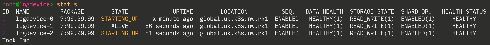

## 1. Provision the servers
The recommended minimum for running a fully functional LogDevice cluster is 4 servers. If you want to try out LogDevice on a single machine for development or experimental purposes, you can follow a much simpler process to [run a local cluster](localcluster.md) instead.

Each LogDevice server should have at least 4GB of RAM. For best results the network latency between the servers in the cluster should be low.

The only platform currently supported is Ubuntu 18 LTS "Bionic Beaver".

Make sure that network ports that you choose are open. We recommend that you use the default ports (`4440`, `4441`, `4443`, `5440`, `6440`) Also, the nodes have to be able to communicate with ZooKeeper.

**Note:** This simple tutorial sets up a cluster without any security controls. You should restrict network access to these ports using other means (like a firewall or NAT) to prevent your cluster being open to the world.

## 2. Set up a ZooKeeper ensemble
LogDevice requires ZooKeeper in order to store minimal per-log metadata accessed during sequencer activation and failover.  ZooKeeper can also be used as a mechanism for distributing the config file (see the [Configuration section](#5-create-a-configuration-file) below).

> You can re-use an existing ZooKeeper ensemble, or create a new one. Different LogDevice clusters can use the same ZooKeeper ensemble as long as they have different values in the `cluster` attribute in the LogDevice configuration file.

You can run ZooKeeper on the same system as LogDevice or on separate hardware. For best results, latency from the LogDevice cluster to the ZooKeeper ensemble should be minimal. However, LogDevice doesn't communicate with ZooKeeper outside of config loading / sequencer activation / failover scenarios, so having higher latency to ZooKeeper shouldn't affect performance in steady state.

> You can find a tutorial online on how to set up a proper Zookeeper ensemble. Note that **if the metadata in the ZooKeeper ensemble is lost, the data in the cluster will be corrupted and unreadable**.

#### Unsafe single-node ZooKeeper setup on Ubuntu
If you are just setting up a test LogDevice cluster and are OK with it becoming unusable and losing all your data if you lose your ZooKeeper node, you can set up a single-node Zookeeper ensemble easily on Ubuntu by running this:
```sh
sudo apt-get update && sudo apt-get install zookeeper zookeeperd
```

## 3. Distribute LogDevice to the servers
You can use the Docker image or build LogDevice yourself.
### Option 1. Use Docker image [Recommended]
Get the LogDevice Docker image. You can use the default `latest` tag for the
nightly build. Or pull the latest stable release
```sh
docker pull facebookincubator/logdevice
```

### Option 2. Build LogDevice
Follow the steps at [Build LogDevice](installation.md) to build and install LogDevice.

## 4. Create data folders on storage nodes
Storage nodes store data in shards. Typically each shard maps to a different physical disk. The example commands below create a user and a typical folder structure for LogDevice, and should be run on each storage node. They assume that your data disk is mounted on `/mnt/data0`. The recommended filesystem to be used for data storage in LogDevice is XFS.
```sh
# creates the root folder for data
sudo mkdir -p /data/logdevice/

# writes the number of shards that this box will have
echo 1 | sudo tee /data/logdevice/NSHARDS

# creates symlink for shard 0
sudo ln -s /mnt/data0 /data/logdevice/shard0

# Adds the user for the logdevice daemon
sudo useradd logdevice

# changes ownership for the data directory and the disk
sudo chown -R logdevice /data/logdevice/
sudo chown -R logdevice /mnt/data0/
```

## 5. Create a configuration file
An example of a minimal configuration file with a 3-node ZooKeeper
ensemble hosted on the same machine can be found below (and is also included
in the source tree under `logdevice/examples/logdevice.conf`).

Modify it to adapt it to your situation and save it to a file somewhere
(e.g. `~/logdevice_test.conf`). The parts that you need to modify are:
1. `cluster` attribute to reflect your cluster name.
2. `zookeeper_uri` in the `zookeeper` section - list of ZooKeeper ensemble nodes and ports.
3. `internal_logs` make sure that you are comfortable with the replication
   policy for these critical logs and adjust if necessary.

Detailed explanations of all the attributes can be found in the
[Cluster configuration](configuration.md) docs.

## 6. Store the configuration file

All LogDevice nodes have to have access to the configuration file when starting.
They monitor the file for changes and pick up (most) changes without being restarted,
so ideally they should have access to it while running as well.
There are different ways to ensure this. One option is to store the file on a
shared network filesystem or distribute with chef, ansible, or similar methods.

For the purposes of this tutorial, we will assume that you have distributed that
configuration file via some automation to all nodes and it lives under
`/etc/logdevice.conf`

## 7. Start the admin server on a single node
<!--DOCUSAURUS_CODE_TABS-->
<!--Docker-->
```shell-session
# Also assumes that the configuration file is in /data/logdevice/logdevice.conf
docker run --rm -d --network host --name logdevice-0 \
         -v /data/logdevice:/data/logdevice \
        facebookincubator/logdevice ld-admin-server \
          --config-path /data/logdevice/logdevice.conf
          --enable-maintenance-manager
          --enable-safety-check-periodic-metadata-update
          --maintenance-log-snapshotting
```
<!--Binary-->
```shell-session
# Assuming that the configuration file is in /etc/logdevice.conf
ld-admin-server -- \
    --config-path /etc/logdevice.conf \
    --enable-maintenance-manager \
    --enable-safety-check-periodic-metadata-update \
    --maintenance-log-snapshotting
```
<!--END_DOCUSAURUS_CODE_TABS-->

## 8. Start logdeviced on every node (3 options)

<!--DOCUSAURUS_CODE_TABS-->
<!--Docker-->
```shell-session
# Assuming that data dir is at host's /data/logdevice (where shard0 lives)
# Also assumes that the configuration file is in /data/logdevice/logdevice.conf
# Assumes that docker host IP address is 172.16.0.2

docker run --rm -d --network host --name logdevice-0 \
         -v /data/logdevice:/data/logdevice \
        facebookincubator/logdevice logdeviced \
          --config-path /data/logdevice/logdevice.conf \
          --name logdevice-0 \
          --address 172.16.0.2 \
          --local-log-store-path /data/logdevice
```
<!--Binary-->
```shell-session
# Assuming that the configuration file is in /etc/logdevice.conf
# Assumes that the host IP address is 172.16.0.2
# Uses the hostname as the logdevice node name
logdeviced \
  --config-path /etc/logdevice.conf \
  --name $(hostname) \
  --address 172.16.0.2 \
  --local-log-store-path /data/logdevice
```
<!--END_DOCUSAURUS_CODE_TABS-->


## 9. See if it's running
`ldshell` is a utility to introspect and mutate the state of LogDevice. One of
its most powerful commands is `query`, which allows you to run SQL `SELECT`
queries against [various virtual SQL tables](administration/ldquery.md) that
expose the state of the cluster and some of its internals. The following command
queries the `info` table. The output displays the start time of the nodes that
are up, their pids and a couple more fields:
<!--DOCUSAURUS_CODE_TABS-->
<!--Docker-->
```shell-session
# Assumes that the admin server host IP address is 172.16.0.1
docker run --rm -ti --network host facebookincubator/logdevice \
         ldshell --admin-server-host 172.16.0.1
```
<!--Binary-->
```shell-session
# Assumes that the admin server host IP address is 172.16.0.1
ldshell --admin-server-host 172.16.0.1
```
<!--END_DOCUSAURUS_CODE_TABS-->

Then inside the interactive session of ldshell you can run:
```sh
ubuntu@logdevice1> SELECT * FROM info
```

## 10. Bootstrap the cluster
Following the cluster [bootstrapping
instructions](administration/maintenances.md#bootstrapping-the-cluster). We
should be able to bootstrap the nodes and configure the metadata logs
replication property.
> In this example setup, we are assuming that we will replicate the metadata
> logs on 3 nodes without location awareness.

In ldshell's interactive session, run:
```shell-session
ubuntu@logdevice1> nodes-config bootstrap metadata-replicate-across={node:3}
```

## 11. Check cluster status
In a few seconds the cluster bootstrapping process should complete, and you
should see the output of the following command:
```shell-session
ubuntu@logdevice1> status
```

It should look similar to this:




## 11. Create log ranges using ldshell
Before you can write any data to LogDevice logs, you need to create them. By default, the cluster starts with an empty log list. To add a log range called `test_logs` with 100 logs where the data would be replicated across 2 nodes and trimmed after 3 days, run this command:
```shell-session
# Assumes that the admin server host IP address is 172.16.0.1
ldshell -s 172.16.0.1 logs create --replicate-across "node: 2" --backlog "259200s" --from 1 --to 100 /test_logs
```

More information about managing your log configuration is available [here](log_configuration.md).

## 12. Write data into a log
All ready to go! You can now write your first payload into log 1:
<!--DOCUSAURUS_CODE_TABS-->
<!--Docker-->
```shell-session
docker run --rm -ti --network host facebookincubator/logdevice /bin/bash

$ echo payload | ldwrite /data/logdevice/logdevice.conf -l 1
```
<!--Binary-->
```shell-session
echo payload | ldwrite /etc/logdevice.conf -l 1
```
<!--END_DOCUSAURUS_CODE_TABS-->

## 12. Read data from a log
This command runs the tailer for log 1. If you did the write above, it should print out "payload".
<!--DOCUSAURUS_CODE_TABS-->
<!--Docker-->
```shell-session
docker run --rm -ti --network host facebookincubator/logdevice /bin/bash

$ ldtail /data/logdevice/logdevice.conf -l 1
```
<!--Binary-->
```shell-session
ldtail /etc/logdevice.conf -l 1
```
<!--END_DOCUSAURUS_CODE_TABS-->

## All done!
Congratulations! You have a running LogDevice cluster! Read the [Introduction to the API](API_Introduction.md) to learn how to use it.
