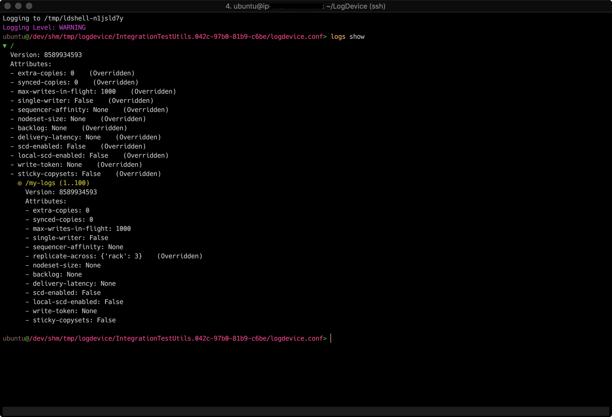

The LogDevice shell is the standard administrative tool for LogDevice
clusters, the tool offers two modes of operation, a CLI mode where you pass
the commands to `ldshell` as arguments to execute and exit. Another mode is the
_interactive_ mode where you start ldshell connected to a cluster without
passing a command, this will drop you into an interactive shell where you can
execute consecutive commands and get dynamic help and auto-completion of
commands, and arguments along the way.

LDShell is built on top of Facebook's
[python-nubia](https://github.com/facebookincubator/python-nubia.git) framework.
In order to use ldshell with a LogDevice cluster, you will need the location of
the configuration file handy. This can be a local config file or a zookeeper
path if you store the config file there. You can also start ldshell in a
"disconnected" mode by not supplying any arguments. This will start the
interactive mode where you can use the `connect` command to establish a
connection to a running cluster. The `connect` command takes the configuration
path similar to what you would pass in `ldshell -c <config-path>`



## Interactive Mode
```text
# If the configuration file is local
ldshell -c /tmp/my-logdevice-config.conf

# If the configuration is on zookeeper
ldshell -c zk:1.1.1.1:2181,1.1.1.2:2181/test_logdevice_cluster.conf
```
In interactive mode you use use the [LogsConfig](Logs) commands and ldshell will
be helping out with auto-completion and syntax highlighting.

A couple of handy tips, you can exit by "q", "quit", or "Ctrl+D".

# CLI Mode

```text
ldshell -c <config-path> logs show
```

# Using LDQuery from LDShell
LogDevice comes with a SQL-like query interface to query the internal state of
the various components of the system. This system is called [LDQuery](LDQuery)
  and the interface for using this is LDShell "query" command.

## LDQuery via CLI mode

```text
ldshell -c zk:1.1.1.1:2181,1.1.1.2:2181/test_logdevice_cluster.conf query
"SELECT * FROM info"
```

## LDQuery via Interactive mode

```text
ldshell -c zk:1.1.1.1:2181,1.1.1.2:2181/test_logdevice_cluster.conf

asoli@zk:1.1.1.1:2181,1.1.1.2:2181/test_logdevice_cluster.conf> SELECT * FROM info
...
```
